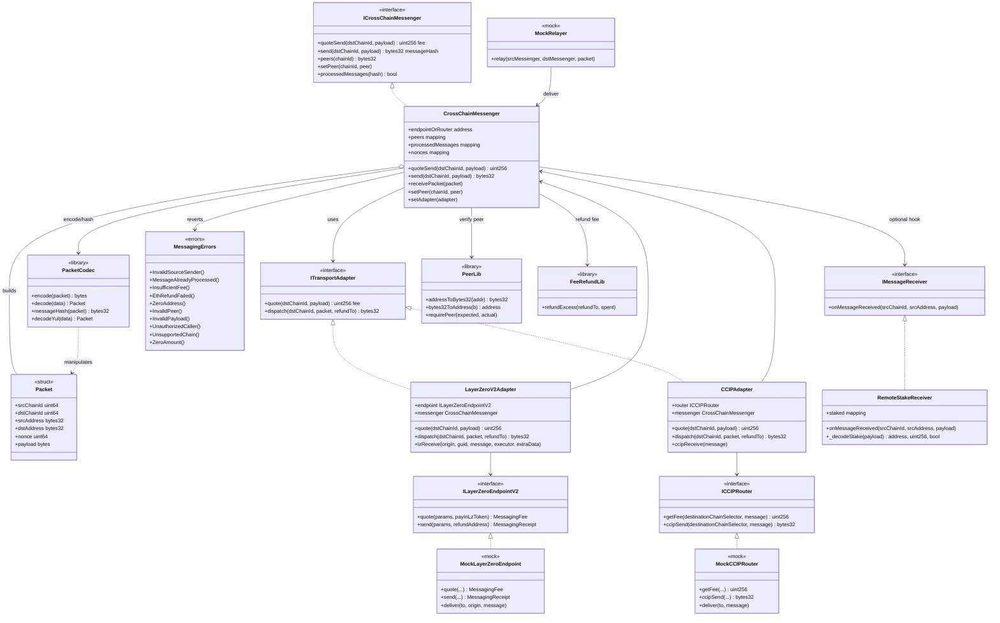

# Diagrama de clases — Cross-Chain Messaging & Interoperability

Vista estructural de contratos, adapters, librerías e interfaces (módulo 16, **diseño v1**).

## Diagrama (Mermaid)

---

## Relaciones clave

| Relación | Descripción |
|----------|-------------|
| Messenger → Adapter | El núcleo no conoce LZ/CCIP; solo `ITransportAdapter` |
| Adapter → Endpoint/Router | Solo el endpoint/router mockeado (o real) puede llamar receive |
| Messenger → PeerLib | `srcAddress` debe coincidir con `peers[srcChainId]` |
| Messenger → PacketCodec | Hash único para `processedMessages` |
| Messenger → FeeRefundLib | Tras `dispatch`, refund de `msg.value - fee` |
| Receiver app | `RemoteStakeReceiver` consume `payload` ya autenticado |

---

## Notas de diseño

- `Ownable2Step` + `ReentrancyGuard` en `CrossChainMessenger` y adapters que muevan ETH.
- Marcar `processedMessages[hash]` **antes** de llamar a `IMessageReceiver` (CEI / anti-reentrancy de mensaje).
- Adapters reales en testnets: mismas interfaces; mocks cubren CI sin RPC.
