# Diagrama de clases — Cross-Chain Messaging & Interoperability

Vista estructural de contratos, adapters, librerías e interfaces (módulo 16, **v1 implementado**).

## Diagrama (Mermaid)

```mermaid
classDiagram
    direction TB

    class ICrossChainMessenger {
        <<interface>>
        +localChainId() uint64
        +peers(chainId) bytes32
        +processedMessages(hash) bool
        +quoteSend(dstChainId, payload) uint256 fee
        +send(dstChainId, payload) bytes32 messageHash
        +receivePacket(packet)
    }

    class IMessageReceiver {
        <<interface>>
        +onMessageReceived(srcChainId, srcAddress, payload)
    }

    class ITransportAdapter {
        <<interface>>
        +quote(dstChainId, payload) uint256 fee
        +dispatch(dstChainId, packet, refundTo) bytes32
    }

    class ILayerZeroEndpointV2 {
        <<interface>>
        +quote(params, sender) MessagingFee
        +send(params, refundAddress) MessagingReceipt
    }

    class ILayerZeroReceiver {
        <<interface>>
        +lzReceive(origin, guid, message, executor, extraData)
    }

    class ICCIPRouter {
        <<interface>>
        +getFee(destinationChainSelector, message) uint256
        +ccipSend(destinationChainSelector, message) bytes32
    }

    class IAny2EVMMessageReceiver {
        <<interface>>
        +ccipReceive(message)
    }

    class MessagingErrors {
        <<errors>>
        +InvalidSourceSender()
        +MessageAlreadyProcessed()
        +InsufficientFee()
        +EthRefundFailed()
        +ZeroAddress()
        +InvalidPeer()
        +InvalidPayload()
        +UnauthorizedCaller()
        +UnsupportedChain()
        +ZeroAmount()
    }

    class Packet {
        <<struct>>
        +srcChainId uint64
        +dstChainId uint64
        +srcAddress bytes32
        +dstAddress bytes32
        +nonce uint64
        +payload bytes
    }

    class PacketCodec {
        <<library>>
        +encode(packet) bytes
        +decode(data) Packet
        +messageHash(packet) bytes32
        +messageHashCalldata(packet) bytes32
        +encodePacked(packet) bytes
        +decodeYul(data) Packet
    }

    class PeerLib {
        <<library>>
        +addressToBytes32(addr) bytes32
        +bytes32ToAddress(b) address
        +requireNonZero(addr)
        +requireConfiguredPeer(peer)
        +requirePeer(expected, actual)
    }

    class FeeRefundLib {
        <<library>>
        +refundExcess(refundTo, fee)
        +refundExcessAssembly(refundTo, fee)
    }

    class CrossChainMessenger {
        +localChainId uint64
        -_selfPeer bytes32
        +adapter ITransportAdapter
        +deliverer address
        +receiver IMessageReceiver
        +peers mapping
        +processedMessages mapping
        +outboundNonces mapping
        +quoteSend(dstChainId, payload) uint256
        +send(dstChainId, payload) bytes32
        +receivePacket(packet)
        +setPeer(chainId, peer)
        +setAdapter(adapter)
        +setDeliverer(deliverer)
        +setReceiver(receiver)
    }

    class LayerZeroV2Adapter {
        +endpoint ILayerZeroEndpointV2
        +messenger ICrossChainMessenger
        +lzPeers mapping
        +quote(dstChainId, payload) uint256
        +dispatch(dstChainId, packet, refundTo) bytes32
        +lzReceive(origin, guid, message, executor, extraData)
        +setLzPeer(eid, remoteAdapter)
    }

    class CCIPAdapter {
        +router ICCIPRouter
        +messenger ICrossChainMessenger
        +ccipPeers mapping
        +quote(dstChainId, payload) uint256
        +dispatch(dstChainId, packet, refundTo) bytes32
        +ccipReceive(message)
        +setCcipPeer(selector, remoteAdapter)
    }

    class RemoteStakeReceiver {
        +messenger address
        +staked mapping
        +onMessageReceived(srcChainId, srcAddress, payload)
        +setMessenger(messenger)
    }

    class MockTransportAdapter {
        <<mock>>
        +fee uint256
        +lastPacket Packet
        +quote(...) uint256
        +dispatch(...) bytes32
    }

    class MockLayerZeroEndpoint {
        <<mock>>
        +registerOApp(eid)
        +quote(...) MessagingFee
        +send(...) MessagingReceipt
        +deliver(index)
        +deliverLast()
    }

    class MockCCIPRouter {
        <<mock>>
        +registerOApp(selector)
        +getFee(...) uint256
        +ccipSend(...) bytes32
        +deliver(index)
        +deliverLast()
    }

    class MockRelayer {
        <<mock>>
        +relay(dst, packet)
    }

    class MockMessageReceiver {
        <<mock>>
        +onMessageReceived(...)
    }

    ICrossChainMessenger <|.. CrossChainMessenger
    IMessageReceiver <|.. RemoteStakeReceiver
    IMessageReceiver <|.. MockMessageReceiver
    ITransportAdapter <|.. LayerZeroV2Adapter
    ITransportAdapter <|.. CCIPAdapter
    ITransportAdapter <|.. MockTransportAdapter
    ILayerZeroEndpointV2 <|.. MockLayerZeroEndpoint
    ILayerZeroReceiver <|.. LayerZeroV2Adapter
    ICCIPRouter <|.. MockCCIPRouter
    IAny2EVMMessageReceiver <|.. CCIPAdapter

    CrossChainMessenger --> ITransportAdapter : uses
    CrossChainMessenger --> PacketCodec : hash
    CrossChainMessenger --> PeerLib : verify peer
    CrossChainMessenger --> FeeRefundLib : refundAssembly
    CrossChainMessenger --> MessagingErrors : reverts
    CrossChainMessenger o-- Packet : builds
    CrossChainMessenger --> IMessageReceiver : optional hook

    LayerZeroV2Adapter --> ILayerZeroEndpointV2
    LayerZeroV2Adapter --> PacketCodec : packed wire
    LayerZeroV2Adapter --> CrossChainMessenger
    CCIPAdapter --> ICCIPRouter
    CCIPAdapter --> PacketCodec : packed wire
    CCIPAdapter --> CrossChainMessenger

    MockRelayer --> CrossChainMessenger : deliver
    PacketCodec ..> Packet : manipulates
```

---

## Relaciones clave

| Relación | Descripción |
|----------|-------------|
| Messenger → Adapter | Núcleo solo ve `ITransportAdapter` (mock / LZ / CCIP) |
| Adapter → Endpoint/Router | Solo endpoint/router puede `lzReceive` / `ccipReceive` |
| Messenger → deliverer | Solo `deliverer` llama `receivePacket` |
| Messenger → PeerLib | `srcAddress` == `peers[srcChainId]` |
| Messenger → PacketCodec | `messageHash` / `messageHashCalldata` para idempotencia |
| Messenger → FeeRefundLib | Tras `dispatch`, `refundExcessAssembly(msg.sender, fee)` |
| Adapters → PacketCodec | Wire packed (`encodePacked` / `decodeYul`) |
| Receiver app | `RemoteStakeReceiver` confía en messenger ya autenticado |

---

## Notas de diseño

- `Ownable2Step` + `ReentrancyGuard` en messenger y adapters.
- `_selfPeer` immutable evita recalcular `addressToBytes32(this)` en cada tx.
- Marcar `processedMessages[hash]` **antes** de `IMessageReceiver` (CEI).
- Suite: **81 PASS / 2 SKIP** (dual-fork sin RPC). Ver [`GAS.md`](./GAS.md) y [`SWC-AUDIT.md`](./SWC-AUDIT.md).
