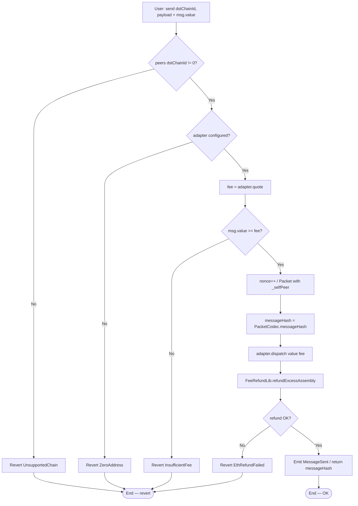
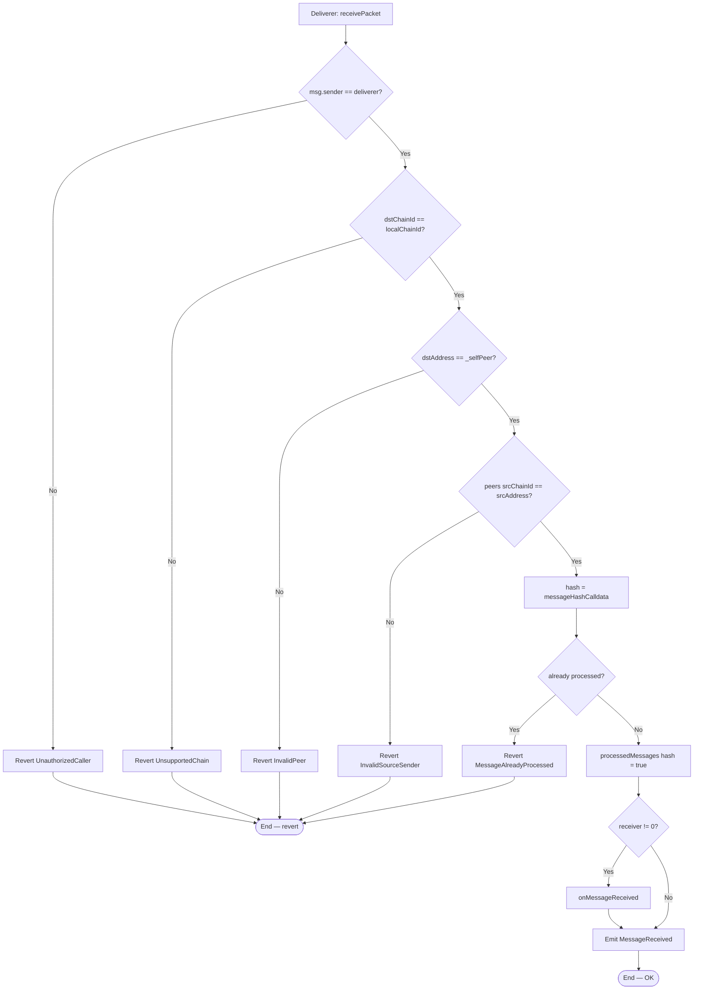
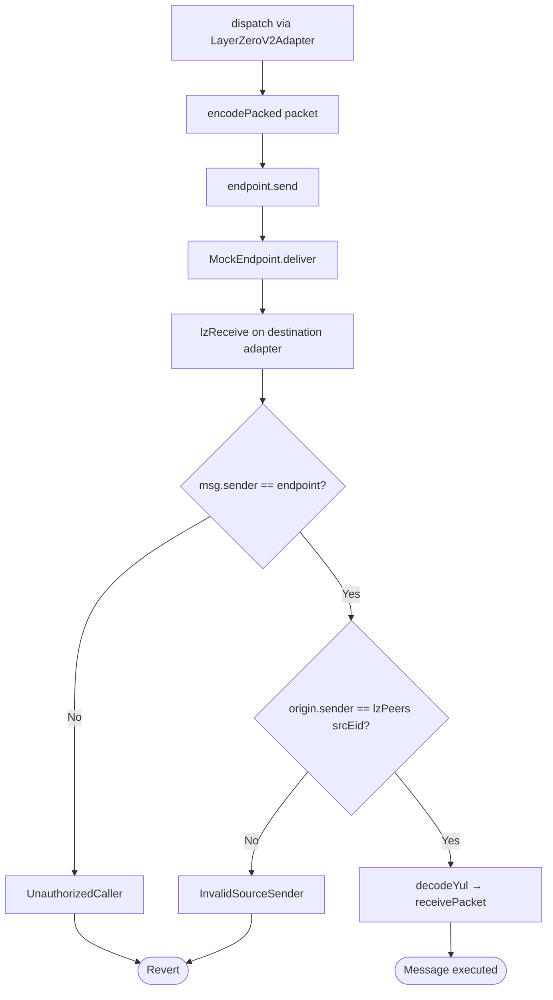
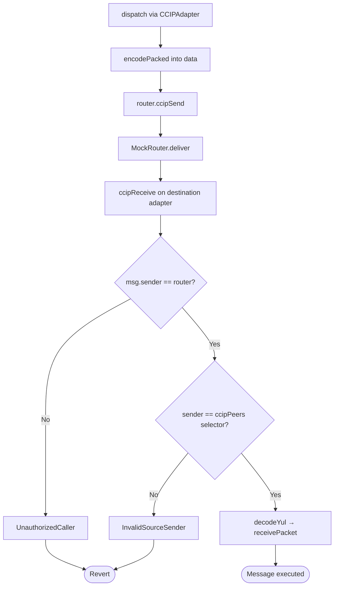
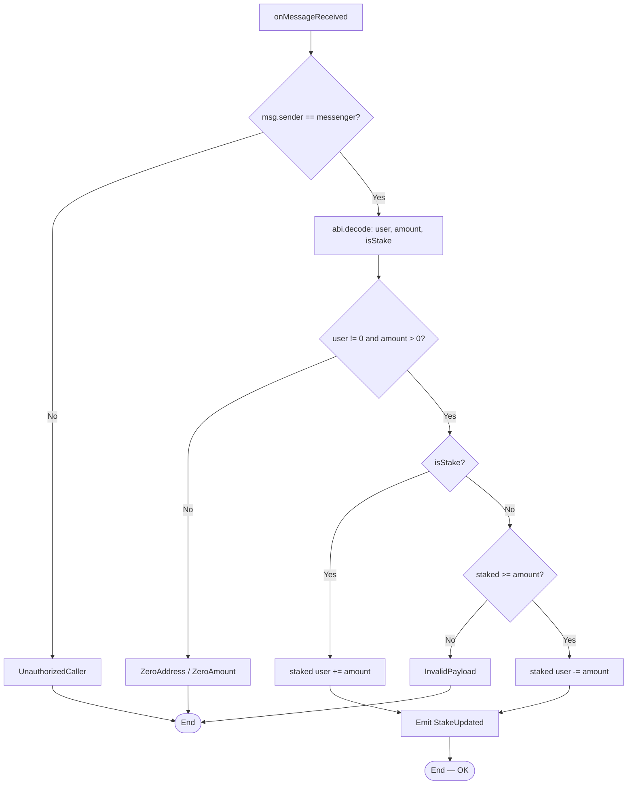
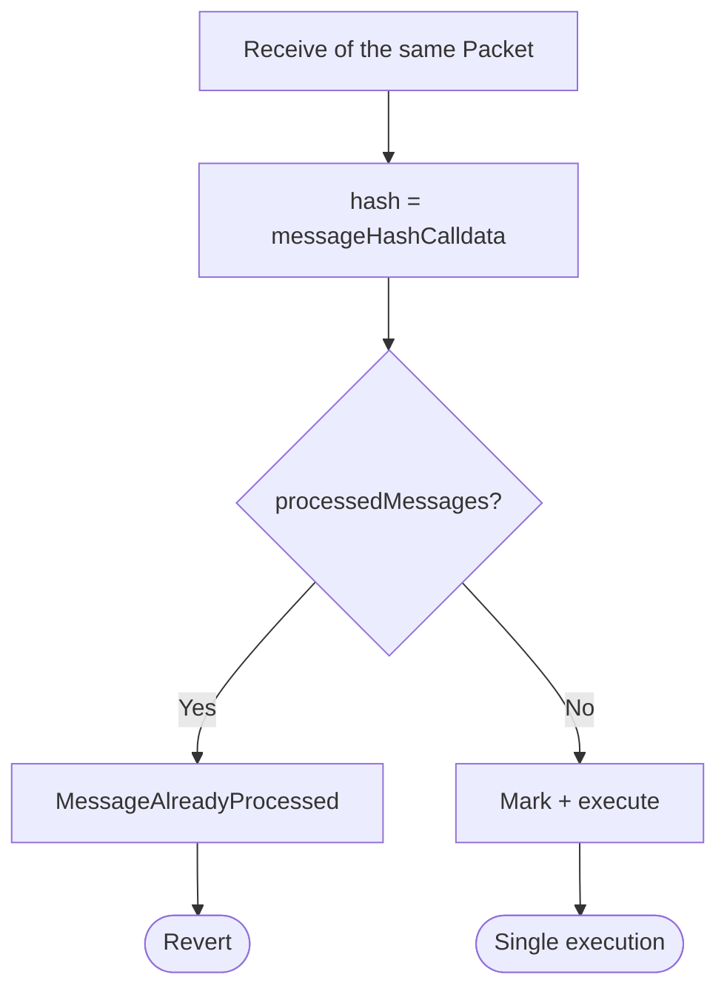
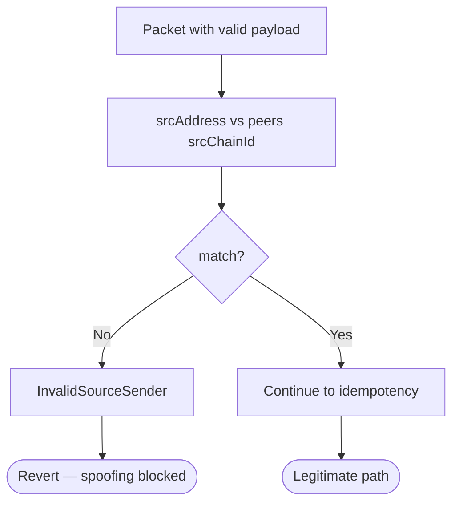

# Flow diagram — Quote, send, verify, and execute

**Language:** English · [Español](./diagrama-de-flujo-ES.md)

Internal decision flows of the messenger and adapters (module 16, **v1 implemented**).

## 1. quoteSend + send (source chain)

> Production: `refundExcessAssembly` (Yul). Tests compare it against `refundExcess` (`.call`) — see [`GAS-EN.md`](./GAS-EN.md).

---

## 2. receivePacket (destination chain)

> App payload validation (`ZeroAmount`, etc.) happens **inside** the receiver; if it reverts, the whole tx reverts and the hash is not marked.

---

## 3. LayerZero V2 path (mock / lab)

---

## 4. Chainlink CCIP path (mock / lab)

---

## 5. RemoteStakeReceiver — remote execution

---

## 6. Anti-replay

---

## 7. Unauthorized sender

