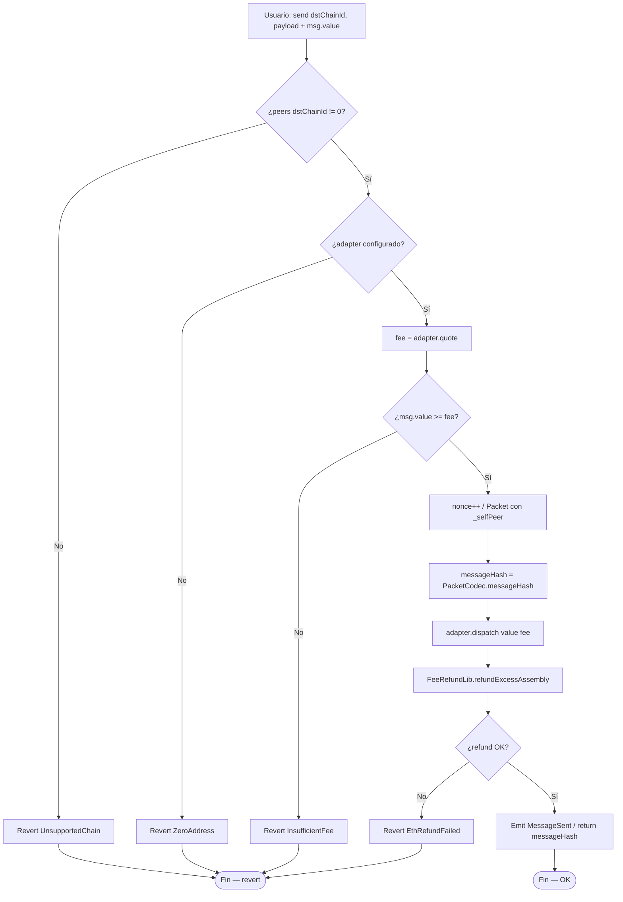
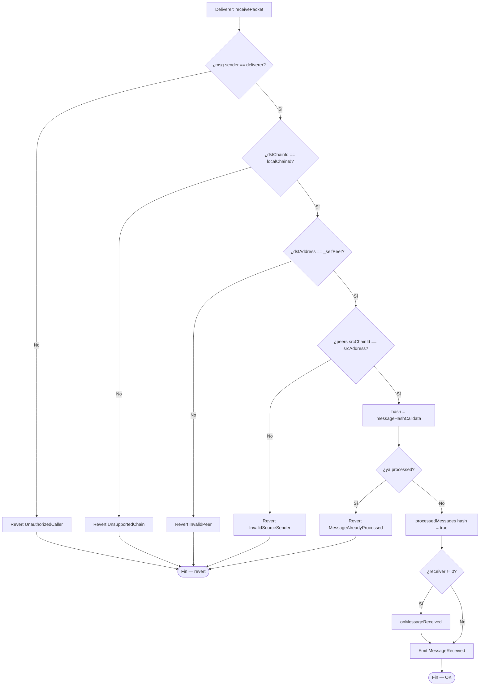
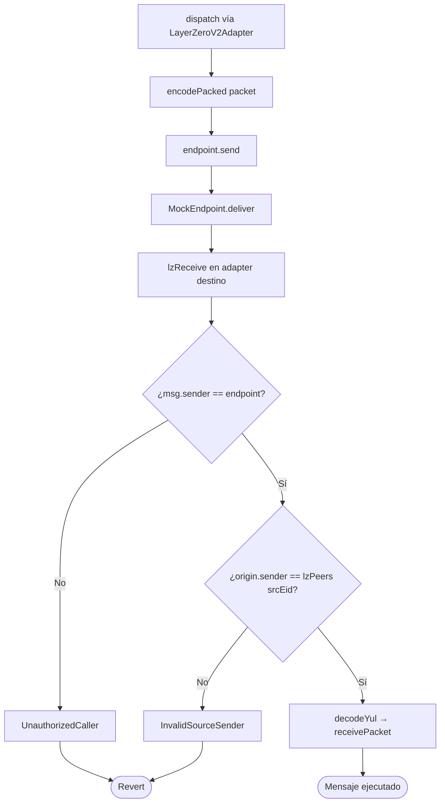
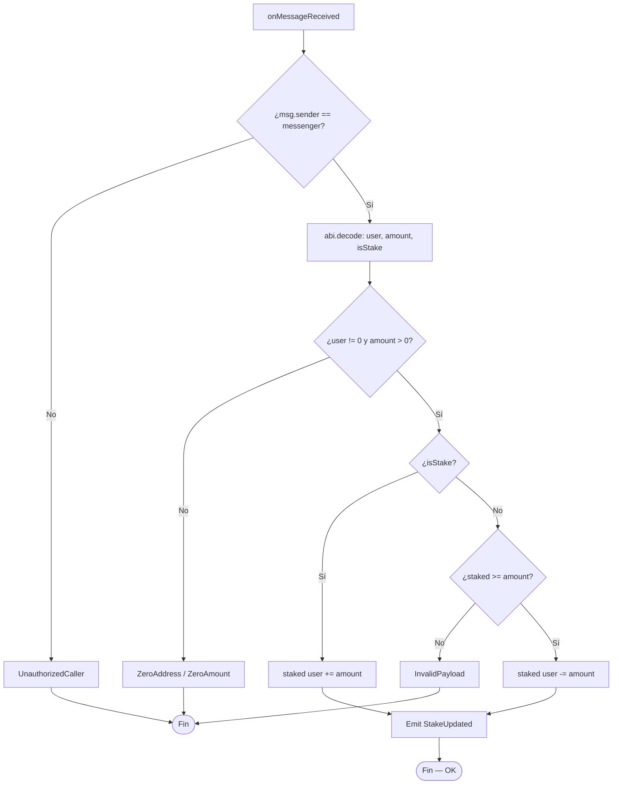
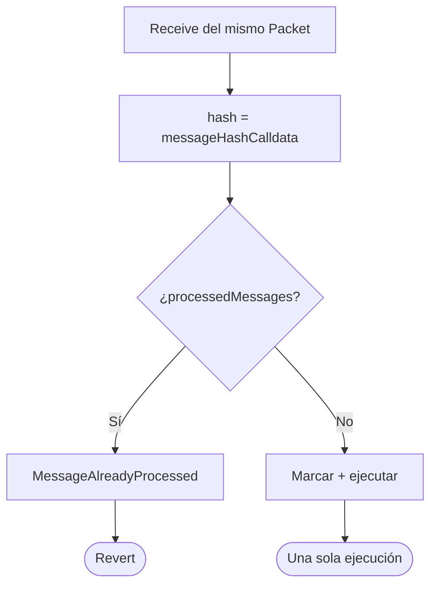
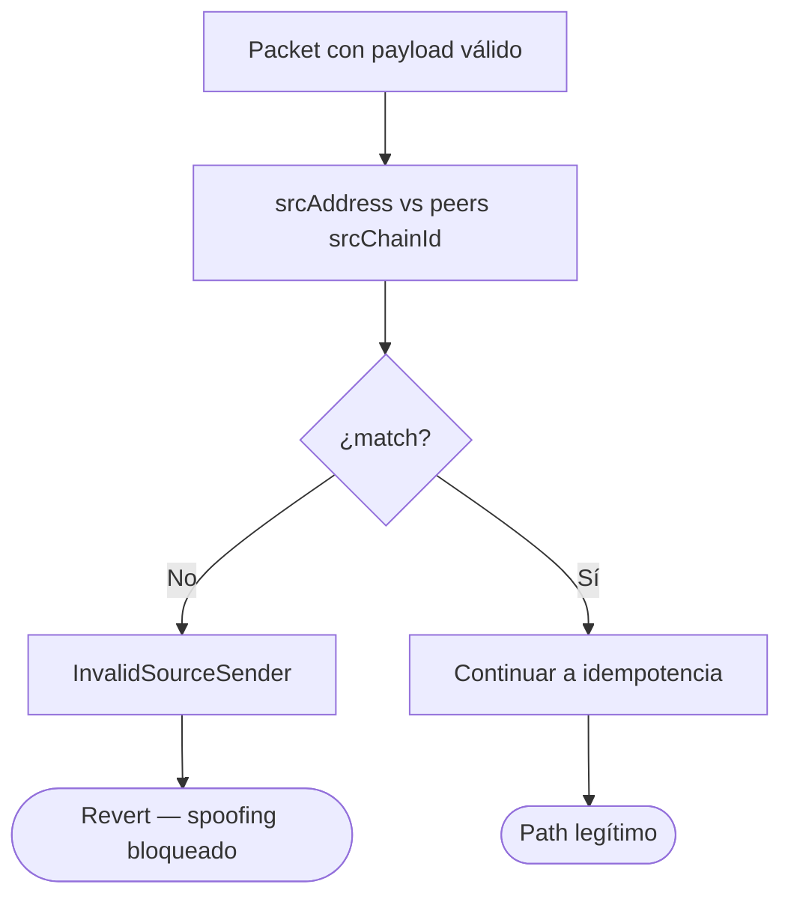

# Diagrama de flujo — Quote, send, verify y execute

Flujos de decisión internos del messenger y adapters (módulo 16, **v1 implementado**).

## 1. quoteSend + send (cadena origen)

> Producción: `refundExcessAssembly` (Yul). Tests comparan vs `refundExcess` (`.call`) — ver [`GAS.md`](./GAS.md).

---

## 2. receivePacket (cadena destino)

> Validación de payload app (`ZeroAmount`, etc.) ocurre **dentro** del receiver; si revierte, toda la tx revierte y el hash no queda marcado.

---

## 3. LayerZero V2 path (mock / lab)

---

## 4. Chainlink CCIP path (mock / lab)

---

## 5. RemoteStakeReceiver — ejecución remota

---

## 6. Anti-replay

---

## 7. Unauthorized sender

