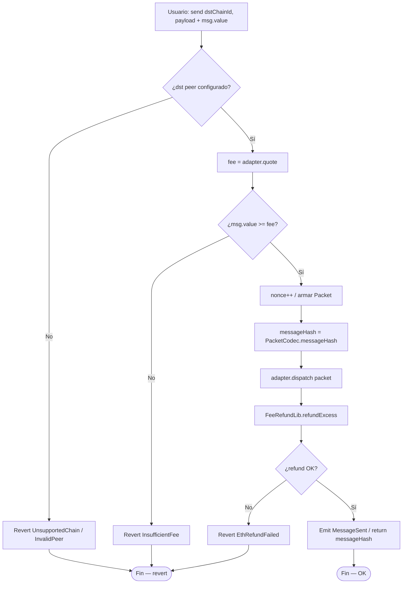
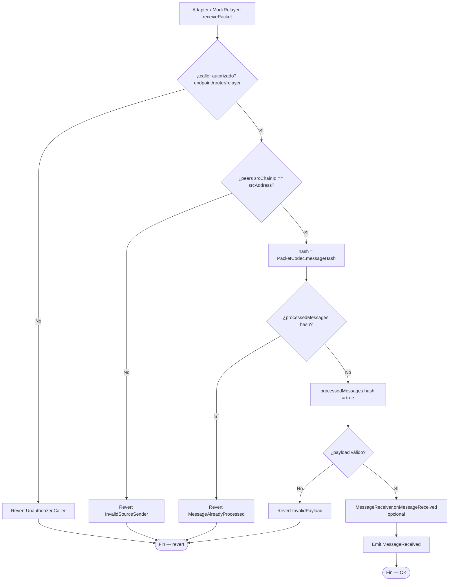
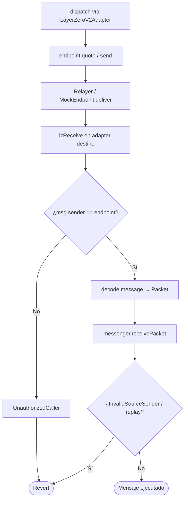
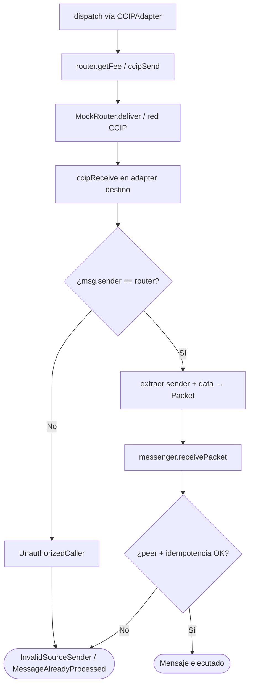
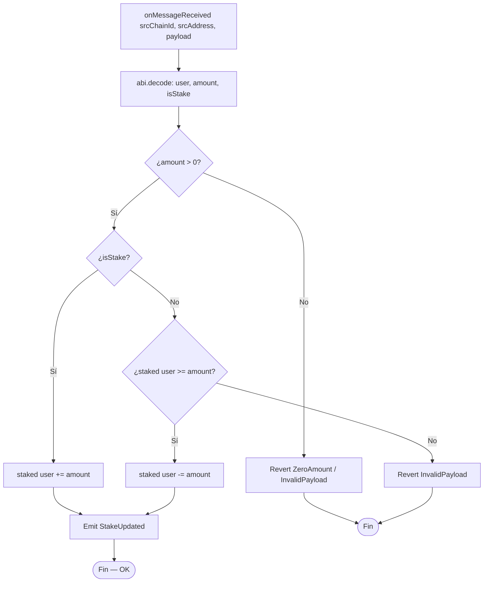
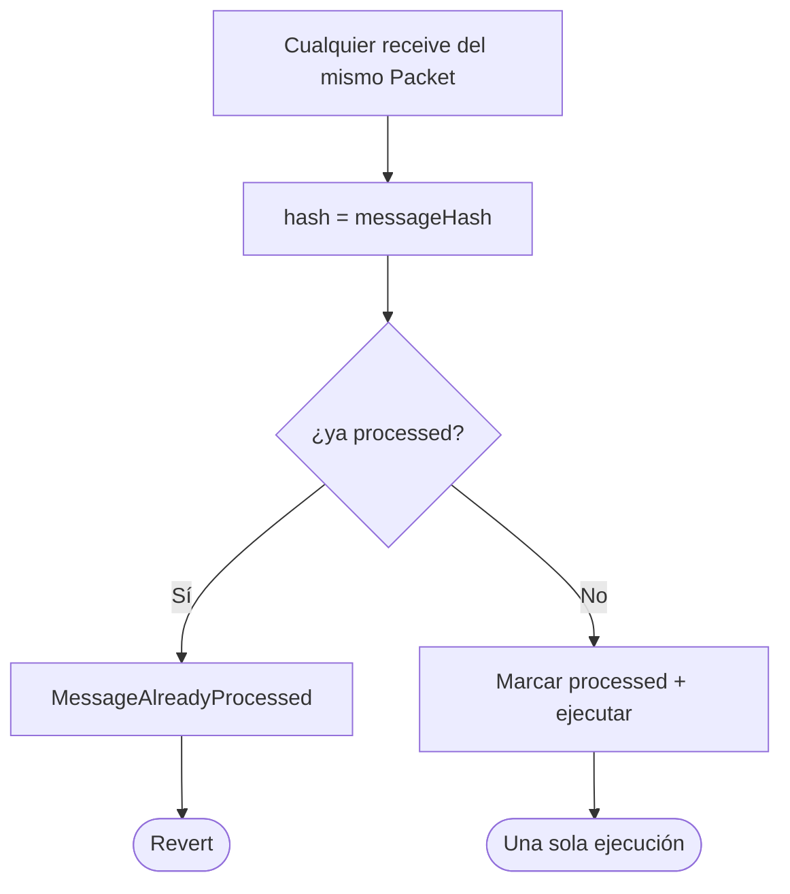

# Diagrama de flujo — Quote, send, verify y execute

Flujos de decisión internos del messenger y adapters (módulo 16, **v1 implementado**).

## 1. quoteSend + send (cadena origen)

> El refund usa `.call{value: ...}("")` hacia `msg.sender` (o `refundTo` explícito).

---

## 2. receivePacket (cadena destino)

> Orden CEI: checks → effect (`processedMessages`) → interaction (receiver).

---

## 3. LayerZero V2 path (mock / real)

---

## 4. Chainlink CCIP path (mock / real)

---

## 5. RemoteStakeReceiver — ejecución remota

> El receiver **no** re-verifica peers: confía en que solo el messenger autenticado lo invoca.

---

## 6. Anti-replay transversal

---

## 7. Unauthorized sender

