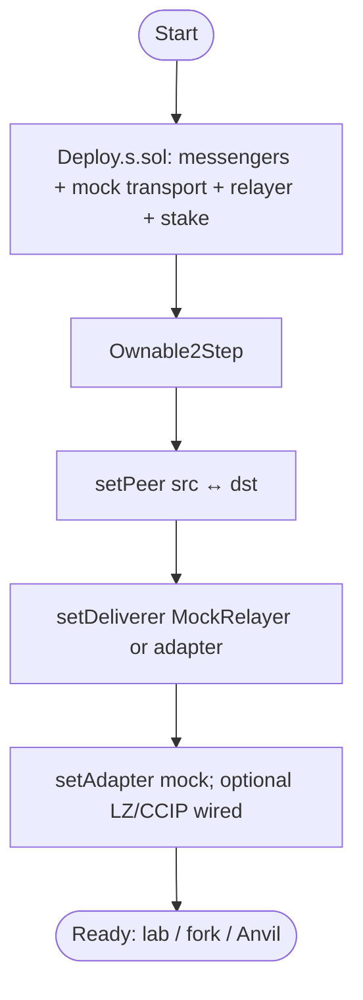
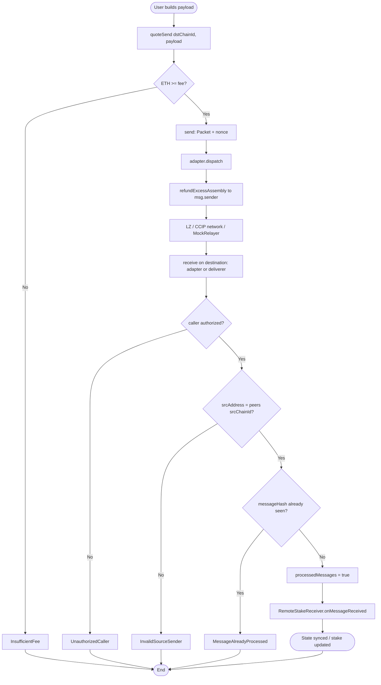
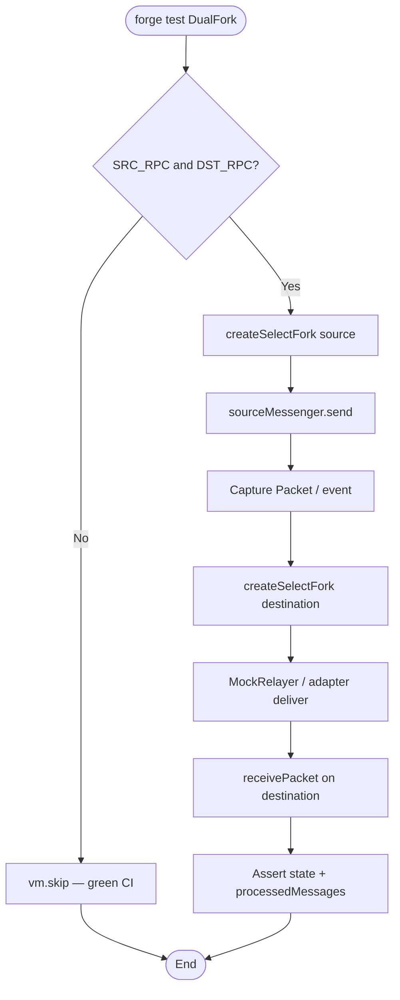
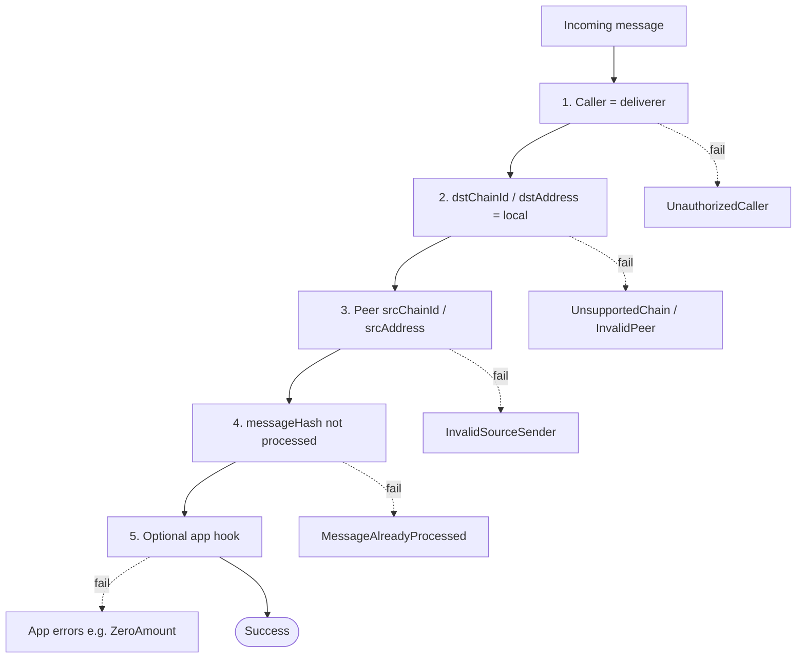
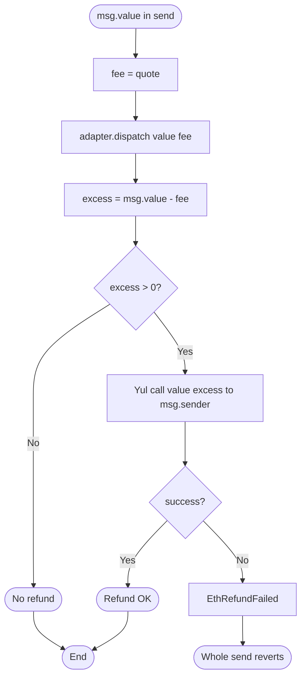

# Flowchart — Full Cross-Chain Messaging cycle

**Language:** English · [Español](./flujograma-ES.md)

End-to-end flow between actors, messenger, adapters, and relayer (module 16, **v1 implemented**).

## Actors

| Actor | Role |
|-------|------|
| User / dApp | Pays the native fee; calls `send` with a payload |
| CrossChainMessenger (source) | Quote, builds the `Packet`, dispatch, `refundExcessAssembly` |
| Transport adapter (LZ / CCIP / mock) | Talks to endpoint/router; packed Yul wire on LZ/CCIP |
| Relayer / MockRelayer / LZ-CCIP network | Delivers the message to the destination |
| CrossChainMessenger (destination) | Deliverer + peer + `messageHashCalldata` + anti-replay |
| RemoteStakeReceiver | Applies the stake/unstake from the payload |
| Admin / owner | setPeer / setAdapter / setDeliverer / setReceiver |
| CI / Foundry | Unit, lib fuzz, dual-fork skip, gas snapshot |

---

## Flowchart — Deploy + peers

---

## Main flowchart — Source → destination

---

## Flowchart — Dual-fork (tests)

---

## Flowchart — Defense layers

---

## Flowchart — Fees and refund

---

## Happy / failure path matrix

| Scenario | Expected result |
|----------|-----------------|
| Correct peer + fee OK + first receive | `MessageReceived` + app effect |
| Wrong peer | `InvalidSourceSender` |
| Same hash twice | `MessageAlreadyProcessed` |
| `msg.value < fee` | `InsufficientFee` |
| Caller ≠ deliverer (or ≠ endpoint/router in adapter) | `UnauthorizedCaller` |
| Refund recipient rejects ETH | `EthRefundFailed` (send reverts) |

---

## Relation to other diagrams

- Type structure: [`diagrama-de-clases-EN.md`](./diagrama-de-clases-EN.md)
- Detailed internal decisions: [`diagrama-de-flujo-EN.md`](./diagrama-de-flujo-EN.md)
- Phases / gas / SWC: [`planificacion-EN.md`](./planificacion-EN.md) · [`GAS-EN.md`](./GAS-EN.md) · [`SWC-AUDIT-EN.md`](./SWC-AUDIT-EN.md)
