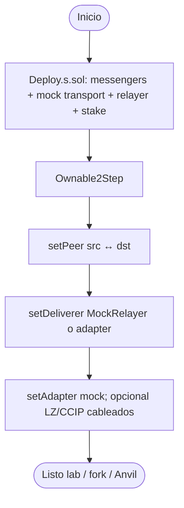
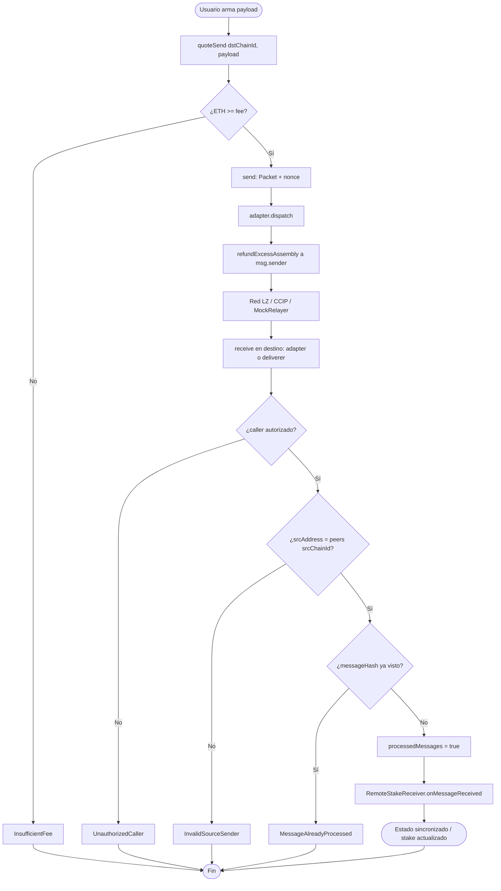
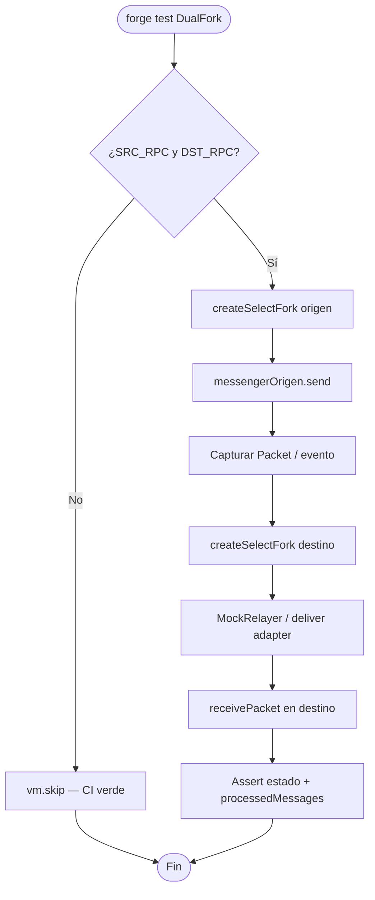
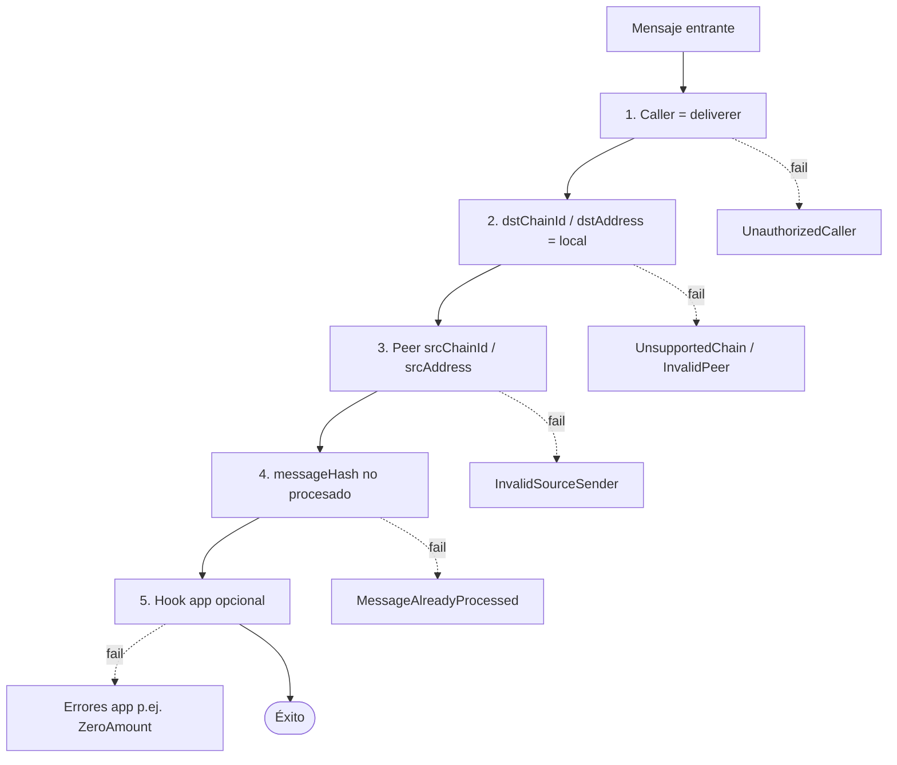
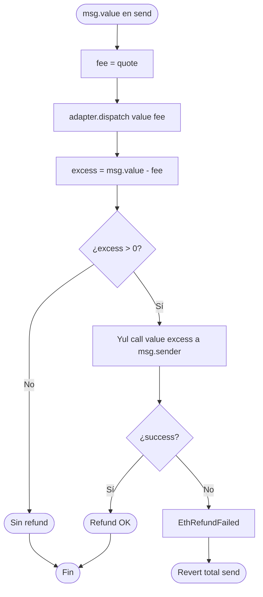

# Flujograma — Ciclo completo Cross-Chain Messaging

Flujo extremo a extremo entre actores, messenger, adapters y relayer (módulo 16, **v1 implementado**).

## Actores

| Actor | Rol |
|-------|-----|
| Usuario / dApp | Paga fee nativo; llama `send` con payload |
| CrossChainMessenger (origen) | Quote, arma `Packet`, dispatch, `refundExcessAssembly` |
| Transport adapter (LZ / CCIP / mock) | Habla con endpoint/router; wire packed Yul en LZ/CCIP |
| Relayer / MockRelayer / red LZ-CCIP | Entrega el mensaje a destino |
| CrossChainMessenger (destino) | Deliverer + peer + `messageHashCalldata` + anti-replay |
| RemoteStakeReceiver | Aplica stake/unstake del payload |
| Admin / owner | setPeer / setAdapter / setDeliverer / setReceiver |
| CI / Foundry | Unit, fuzz libs, dual-fork skip, gas snapshot |

---

## Flujograma — Deploy + peers

---

## Flujograma principal — Origen → destino

---

## Flujograma — Dual-fork (tests)

---

## Flujograma — Capas de defensa

---

## Flujograma — Fees y refund

---

## Matriz de caminos felices / fallo

| Escenario | Resultado esperado |
|-----------|-------------------|
| Peer correcto + fee OK + primer receive | `MessageReceived` + efecto app |
| Peer incorrecto | `InvalidSourceSender` |
| Mismo hash dos veces | `MessageAlreadyProcessed` |
| `msg.value < fee` | `InsufficientFee` |
| Caller ≠ deliverer (o ≠ endpoint/router en adapter) | `UnauthorizedCaller` |
| Receptor de refund rechaza ETH | `EthRefundFailed` (send revierte) |

---

## Relación con otros diagramas

- Estructura de tipos: [`diagrama-de-clases.md`](./diagrama-de-clases.md)
- Decisiones internas detalladas: [`diagrama-de-flujo.md`](./diagrama-de-flujo.md)
- Fases / gas / SWC: [`planificacion.md`](./planificacion.md) · [`GAS.md`](./GAS.md) · [`SWC-AUDIT.md`](./SWC-AUDIT.md)
